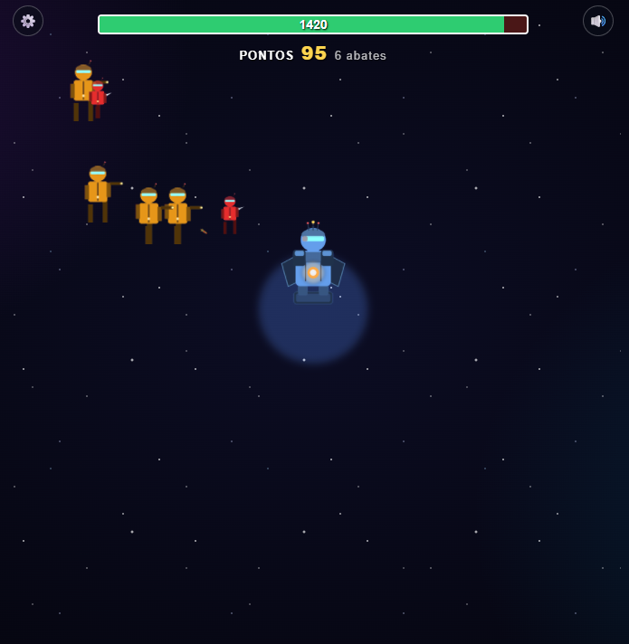
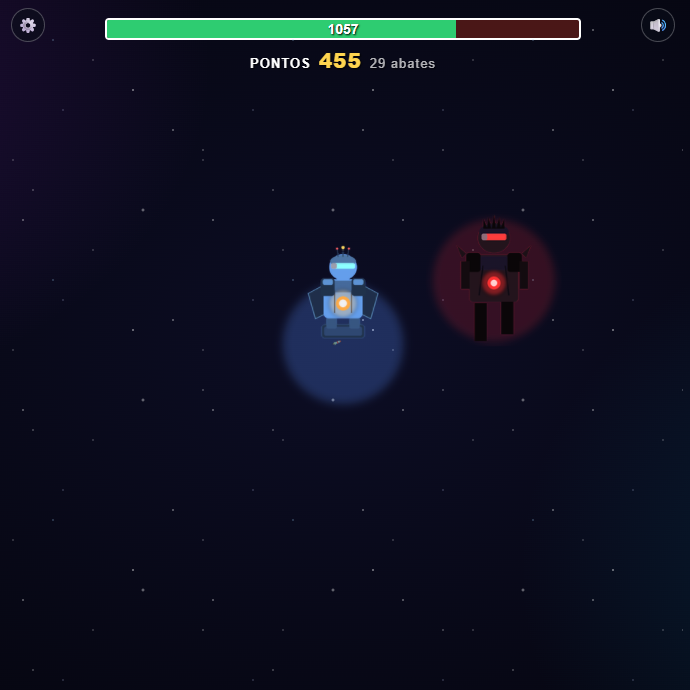

# Space-Wars

Esse repositório se trata do jogo no estilo Tower Defense para a disciplina de Computação Gráfica relativo ao Trabalho Prático 1 feito em WebGL e JavaScript.

Defenda sua torre dos inimigos que irão aparecer. Eles podem atacar de diversas formas, cuidado com as explosões.

Caso sua torre esteja com dificuldade, você consegue ajudar a atacar os inimigos com a sua Espada de Energia.

Melhore sua torre conforme elimina os inimigos, eles vão ficar mais fortes com o tempo.

> ⚠️ Se a vida da sua torre chegar a zero, é **Fim de Jogo**.

# Criadores

* **Custódio Júnio Queiroz Silva** — [@Cjunio23](https://github.com/Cjunio23)
* **Hugo Henrique de Andrade Cardoso** — [@hhdacardoso](https://github.com/hhdacardoso)

# Media Kit
<table>
  <tr>
    <td align="center" width="33%">
      <b>Tela Inicial</b>  
      
    </td>
    <td align="center" width="33%">
      <b>Gameplay</b>  
      
    </td>
    <td align="center" width="33%">
      <b>Boss</b>  
      
    </td>
  </tr>
</table>

# Opcionais

- **Inimigos Diversificados:**
  - **Melee:** Inimigos de ataque corpo a corpo.
  - **Ranged:** Inimigos que atacam à distância.
  - **Exploder (Kamikaze):** Inimigos que se autodestroem ao atingir o alvo.
- **Caminho dos Inimigos:** Os oponentes percorrem uma sequência fixa de *checkpoints* até alcançar a torre (com exceção dos *Rangeds*, que podem atacar de mais longe).
- **Trilha Sonora e SFX:** Músicas temáticas e efeitos sonoros imersivos.
- **Interface Customizada:** Cursor personalizado para maior imersão.
- **Gráficos e Animações:** Uso de texturas animadas.
- **Telas e Menus:** Telas de início, opções/pause, créditos e reinício.

# Créditos
**Sprites/Gráficos:** Gerados proceduralmente através de um script em Python com a biblioteca Pillow com formas geométricas e supersampling 4x. Sem assets de terceiros.
**Áudio/Efeitos Sonoros:** Gerados em tempo real via Web Audio API com osciladores, gain effect, biquad filter e ruído sintetizado.
